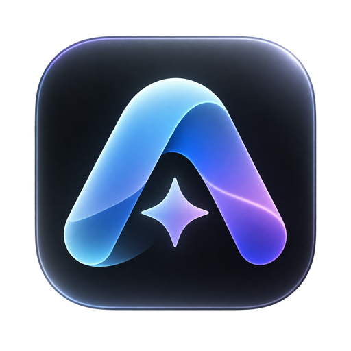

# Aira

Aira 是常驻桌面边缘的 Sub2API 账号池额度监控工具，支持 Windows、macOS 和 Linux。它把 Claude、Codex 与 Grok 账号的剩余额度显示为紧凑的圆环，并提供系统托盘和完整账号面板。



## 下载

从 [Releases](https://github.com/EasyQueen/Aira/releases/latest) 下载对应安装包：

| 系统 | 安装包 |
| --- | --- |
| Windows x64 | `Aira_*_x64-setup.exe` |
| macOS Intel / Apple Silicon | `.dmg`（通用版本） |
| Linux x64 | `.AppImage` 或 `.deb` |

Windows 安装包未进行系统代码签名，安装时可能显示“未知发布者”。macOS 安装包也未进行 Apple 公证。已安装的应用会检查本仓库的最新 Release，并在发现新版本时打开下载地址；安装仍需手动完成。

## 功能

- 桌面边缘的透明额度条：每个账号显示额度圆环，低于或等于 15% 时显示告警色。
- 最近使用提示：账号的 `last_used_at` 落在设置的时间窗口内时，未悬浮的 Logo 轻微显隐。默认窗口为 3 分钟，可在设置中调整；状态随额度轮询更新。
- 多显示器定位：拖动额度条到目标显示器，松开后贴合该显示器右侧，重启后恢复位置。
- 系统托盘与账号面板：查看账号详情、刷新额度、打开设置或管理后台。
- 可调展示模型、账号数、刷新频率、最近使用判定、卡片不透明度、置顶和开机启动。
- 管理员登录支持两步验证；密码不写入磁盘，refresh token 保存在系统凭据存储中。

macOS 以菜单栏应用方式运行，默认不在 Dock 显示；入口是桌面额度条和菜单栏图标。最近使用提示表示“近期请求过”，不代表此刻仍有请求在执行。

## 连接 Sub2API

1. 打开 Aira，在设置窗口输入 Sub2API 站点地址与管理员邮箱、密码。
2. 如启用了两步验证，输入验证码。
3. 连接后选择要展示的模型和账号数。

远程站点需使用 HTTPS，本地开发地址 `localhost` / `127.0.0.1` 可使用 HTTP。额度数据来自你的 Sub2API 后台；自动刷新默认每 30 秒一次，也可以手动刷新。

## 开发

需要 Node.js、Rust 工具链及 [Tauri 2 平台依赖](https://v2.tauri.app/start/prerequisites/)：

```bash
npm ci
npm run tauri dev
```

仅预览网页界面可运行 `npm run dev`。验证和打包：

```bash
npm run build
cargo test --manifest-path src-tauri/Cargo.toml --lib
npm run tauri build
```

无需在本机安装 Rust 也可以使用 GitHub Actions 的手动工作流生成 Windows、macOS 和 Linux 安装包。工作流产物上传为 Actions artifact；正式下载入口为 Releases。

## 来源

本项目基于 [boycott96/sub2api-token](https://github.com/boycott96/sub2api-token) 修改，保留了上游提交历史。跨屏贴边与最近使用提示为后续改动。

本仓库在取得上游作者授权后按 [MIT License](LICENSE) 发布。原作者和后续贡献者的署名保留在提交历史中。
