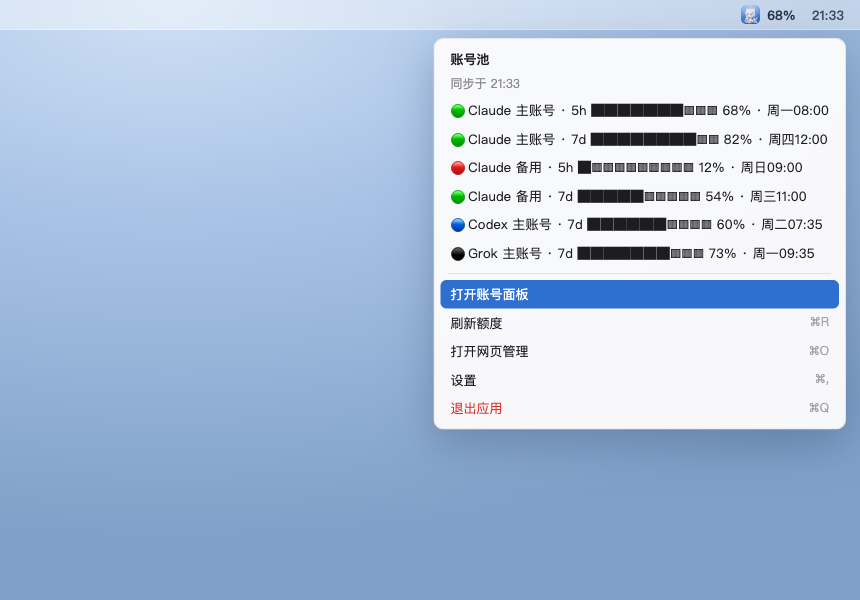
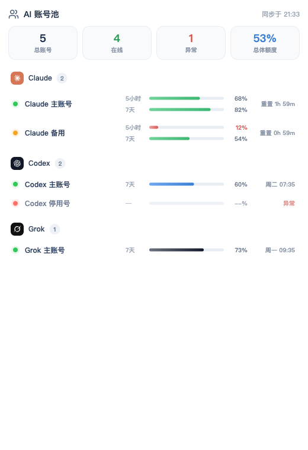
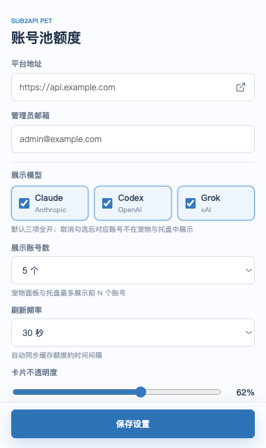

<div align="center">


# Sub2API Pet

**常驻桌面的 AI 账号池额度监控桌宠** · 基于 [Tauri 2](https://tauri.app/) 构建

一只可爱的桌面猫娘，帮你实时盯着账号池里 **Claude / Codex / Grok** 的额度，
低额度时会主动提醒你。

</div>

---

## ✨ 简介

Sub2API Pet 连接你的 **Sub2API** 管理后台，拉取账号池中所有 AI 账号的额度，
以「桌面宠物 + 菜单栏托盘 + 账号面板」三种形态呈现：

- 屏幕上有一只透明、置顶、可拖动的**桌宠**，旁边挂着额度柱状图；
- 菜单栏（右上角）有**托盘图标**，显示总体额度，点开是带进度条的原生菜单；
- 需要看全部账号时，打开独立的**账号面板**大窗口。

密码不落盘、refresh token 存进系统钥匙串，自动跟随 GitHub Release 升级。

---

## 🖼 界面预览

### 桌面宠物
悬浮在桌面上，宠物旁展示账号池额度柱状图；单击互动、右键菜单、按住拖动，拖到屏幕边缘会「躲」起来。


### 菜单栏托盘菜单
左键 / 右键托盘图标弹出原生菜单：每个账号一行「圆点 · 名称 · 窗口 · 进度条 · 百分比 · 重置时间」，菜单栏图标旁显示**总体额度**。



### 账号面板
展示所有账号额度的独立窗口：顶部汇总（总账号 / 在线 / 异常 / 总体额度），下方按平台分组列出每个账号的各时间窗口进度条。



### 设置
连接平台、选择要展示的模型、展示账号数、刷新频率、卡片不透明度、置顶与开机启动等。



---

## 🚀 功能特性

- 🐱 **桌面宠物**：透明无边框、始终置顶、可自由拖动；单击互动、随心情切换表情、低额度自动进入告警状态；拖到屏幕边缘自动收起为「贴边」小图标，鼠标移上去再展开。
- 📊 **实时额度**：展示账号池中全部 Claude / Codex / Grok 账号的剩余额度，默认每 30 秒读取一次缓存数据，可手动强制刷新。
- 🧭 **菜单栏托盘**：原生菜单，账号额度用 Unicode 进度条 + 百分比 + 重置时间呈现，菜单栏图标旁常显总体额度。
- 🗂 **账号面板**：一个窗口看全部账号，汇总卡片 + 平台分组 + 每个时间窗口的进度条。
- 🎛 **可定制展示**：按模型（Claude / Codex / Grok）筛选、限制展示账号数、调节刷新频率与卡片透明度。
- 🔐 **安全**：支持两步验证（TOTP）、access token 自动续期；refresh token 保存在系统钥匙串，密码不落盘。
- ⬆️ **自动升级**：启动后自动检查 GitHub Release，签名校验通过后安装并重启，也可在设置里手动检查。

---

## 📦 支持的平台与额度窗口

| 平台 | 说明 | 展示窗口 |
| --- | --- | --- |
| **Claude**（Anthropic） | OAuth / setup-token 账号 | `5小时` 会话窗口 + `7天` 周窗口 |
| **Codex**（OpenAI） | OAuth 账号 | `7天` 周窗口 |
| **Grok**（xAI） | 计费账期快照 | `7天`（周）或 `月` 账期 |

> 任一账号剩余额度 ≤ 15% 时，对应进度条转红、宠物切换到告警表情提醒你。

---

## 🏁 快速开始

### 安装
从 [Releases](https://github.com/boycott96/sub2api-token/releases) 下载对应平台安装包：

- **macOS**：`.dmg`
- **Windows**：`.exe` / `.msi`
- **Linux**：`.AppImage` / `.deb`

> macOS 提示：这是一个菜单栏 / 桌宠类应用，**默认不在 Dock 显示**（`Accessory` 模式）。它的入口是屏幕上的宠物本体和右上角菜单栏的托盘图标。

### 连接平台
1. 打开应用，在设置里填写 **Sub2API 站点地址**，例如 `https://sub2api.example.com`（会自动补全 `/api/v1`）。
2. 使用**管理员**邮箱和密码登录；若开启了两步验证，继续输入 6 位验证码。
3. 连接成功后，宠物与托盘即会列出账号池中的全部账号及剩余额度。

> 远程地址必须使用 **HTTPS**；本地开发可用 `localhost` / `127.0.0.1`。需要管理员角色才能读取账号池额度。

---

## 🕹 使用说明

**桌面宠物**
- 单击：与宠物互动（会冒对话气泡）。
- 右键：打开操作菜单 —— 打开账号面板 / 刷新额度 / 打开网页管理 / 设置 / 退出应用。
- 按住拖动：移动宠物；拖到屏幕边缘会收起为贴边小图标，鼠标悬停再展开。

**菜单栏托盘**
- 左键 / 右键托盘图标：弹出原生菜单，查看各账号进度条，或执行刷新 / 打开面板 / 网页管理 / 设置 / 退出。
- 菜单栏图标旁的数字是所有在线账号的**总体剩余额度**。

**账号面板**
- 从托盘菜单或宠物右键菜单的「打开账号面板」进入；也可点击托盘菜单里的任意账号行。
- 这是一个普通的可缩放窗口，会随刷新实时更新，按 `Esc` 关闭。

**设置项**
- 展示模型：勾选要在宠物 / 托盘 / 面板中展示的平台。
- 展示账号数：宠物面板与托盘最多展示前 N 个账号。
- 刷新频率：自动同步缓存额度的时间间隔（10 秒 ~ 10 分钟）。
- 卡片不透明度：宠物旁柱状图背景卡片的透明度（0% 全透明 ~ 100% 不透明）。
- 始终置顶 / 开机启动。

---

## 🔒 安全与隐私

- 登录后仅保存 **refresh token** 到系统钥匙串（macOS Keychain / Windows Credential Manager / Linux Secret Service），**密码不会写入磁盘**。
- access token 过期自动用 refresh token 续期。
- 所有请求走你自己的 Sub2API 后台，应用本身不上报任何数据。

---

## 🛠 开发与构建

```bash
# 安装依赖
npm install

# 本地开发（启动桌面应用）
npm run tauri dev

# 仅预览网页界面（浏览器，使用示例数据）
npm run dev
```

验证与打包：

```bash
npm run build                                         # 前端类型检查 + 构建
cargo test --manifest-path src-tauri/Cargo.toml --lib # Rust 单元测试
npm run tauri build                                   # 生成安装包
```

macOS 安装包生成在 `src-tauri/target/release/bundle/dmg/`。

### 应用图标
图标源图为 1024×1024，通过 `npx tauri icon <源图>` 生成整套（`.icns` / `.ico` / 各尺寸 PNG / iOS / Android）。

---

## 📤 发布与自动升级

自动升级读取仓库 Release 中的 `latest.json`。首次发布前，把本机 `.tauri/sub2api.key`
的完整内容保存为 GitHub Actions Secret `TAURI_SIGNING_PRIVATE_KEY`（当前密钥无密码，
`TAURI_SIGNING_PRIVATE_KEY_PASSWORD` 留空即可）。私钥仅用于发布签名，切勿提交到仓库。

发布前同步修改 `package.json`、`src-tauri/Cargo.toml`、`src-tauri/tauri.conf.json`
中的版本号，然后推送对应 tag：

```bash
git tag v0.2.0
git push origin v0.2.0
```

GitHub Actions 会构建 macOS / Windows / Linux 安装包、生成 updater 签名及 `latest.json`，
全部平台成功后再公开 Release。已安装的客户端会在启动约 3 秒后检查更新，也可在设置页手动检查。

---

## 🧱 技术栈

- **前端**：TypeScript + Vite（多页：宠物 / 托盘面板 / 设置 / 操作菜单）
- **外壳**：Tauri 2（Rust），系统托盘、多窗口、钥匙串、自动更新
- **图标**：[lucide](https://lucide.dev/)
